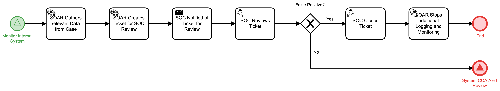

# Analyst Review of System Alerts Detail

## Description
The purpose of this workflow is to handle system alerts that do not fit identified
thresholds for automated response. It is designed to gather all the relevant data from a
SOAR case involving a system alert, create a ticket for a SOC analyst review and then 
notify the SOC of the ticket so that action can be decided.

The workflow is called from the "Monitor Internal System" workflow. 

The end result is to either stop the workflow if the alert was deemed to be a false
postive or to forward the data to the "System COA Alert Review" (respond) workflow

## Workflow 

