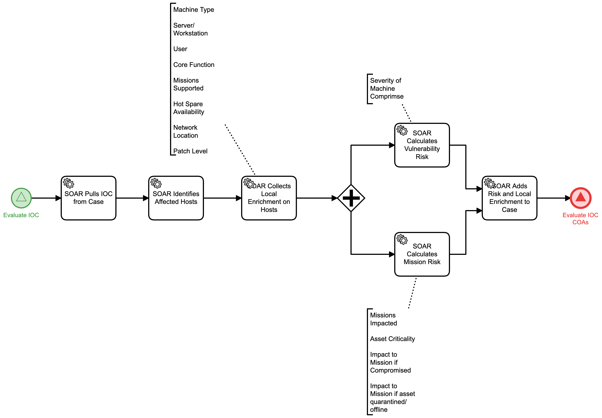

# Calculate IOC Risk Score Detail

## Description
The purpose of this workflow is to aid in the decision logic required to decide a 
course of action in response to an Indicator of Compromise (IOC).  It's primary goal is 
to incorporate risk associated with the IOC. To aid in this calculation, local enrichment 
data may be required. This can consist of a variety of sources to include (but not 
limited to):
- Types of machines affected by IOC
- Whether an affected machine is a server or workstation
- Any users associated with local activity involving the IOC
- Core Function of any affected assets
- Missions supported by affected assets
- Whether or not an affected system has a hot spare
- The network location of any affected systems
- The current patch level of any affected systems

There are multiple kinds of risk that may apply to an IOC and these may result in 
different response options. These can include:
- Vulnerability Risk
   - This is often based on the severity of the potential machine compromise
- Mission Risk
   - The missions impacted by the IOC
   - The criticality of the affected assets
   - The level of impact to missions if assets are compromised
   - The level of impact to missions if an asset is quarantined or offline
   
This workflow is called by the "Evaluate IOC" (Detect) workflow.

This workflow results in forwarding the information to the "Evaluate IOC COAs" (Respond) 
workflow.

## Workflow 

