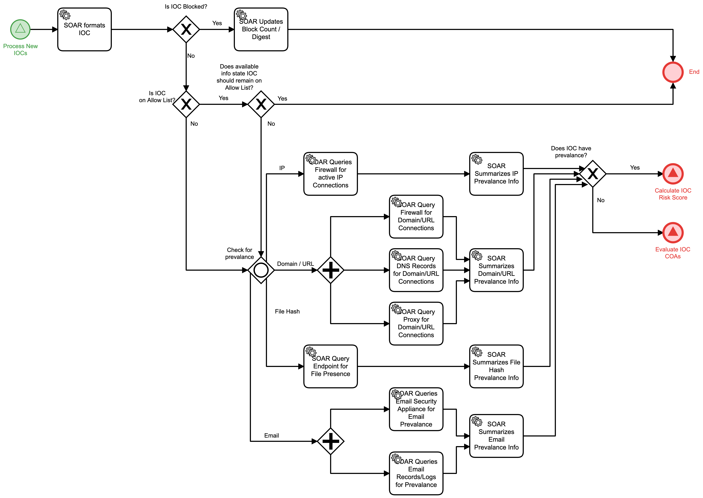

# Evaluate IOC Detail

## Description
This workflow assists with the triage of incoming Indictors of Compromise (IOC)

If an IOC is already blocked or if it is already on an Allow list, the workflow notes the
receipt of the IOC and stops follow-on actions.

For all other IOCs, the workflow collects information as to whether or not there is local
prevalence for the IOC. This means determining if any systems have visited the IP address,
domain, URL, if they have received files identified as an IOC, or received email from a
sender identified as a malicious IOC.

- For IOCs that have prevalence, this workflow will call the "Calculate IOC Risk Score"
(Detect) workflow.

- For IOCs that do not have prevalence, this workflow will call the "Evaluate IOC COAs"
(Respond) workflow.

This workflow is called from the "Process New IOCs" (Detect) workflow.

## Workflow 

