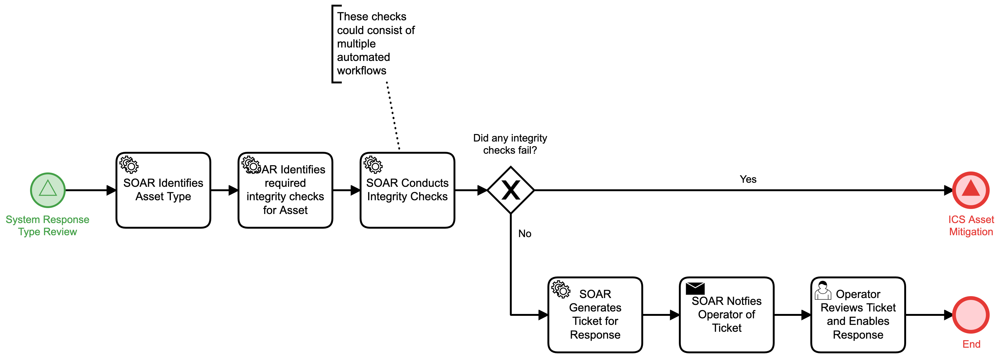

# ICS Asset Integrity Check Detail

## Description
This workflow is triggered when an internal alert is sent to SOAR and that alert involves
an Industrial Control System (ICS) asset. The workflow will identify the assets from the
alert and conduct integrity checks on the asset.

`Note: an asset integrity check may consist of multiple automated workflows. These will
be defined by the organization and are often based on the types of logs and data that can
be collected for the asset`

- For assets that fail an integrity check, the "ICS Asset Mitigation" (Respond) workflow 
is called.
- For assets that do not fail an integrity check, a ticket is generated for manual 
response and the automated workflow is cancelled.

This workflow is called by the "System Response Type Review" (Detect) workflow.

## Workflow 

