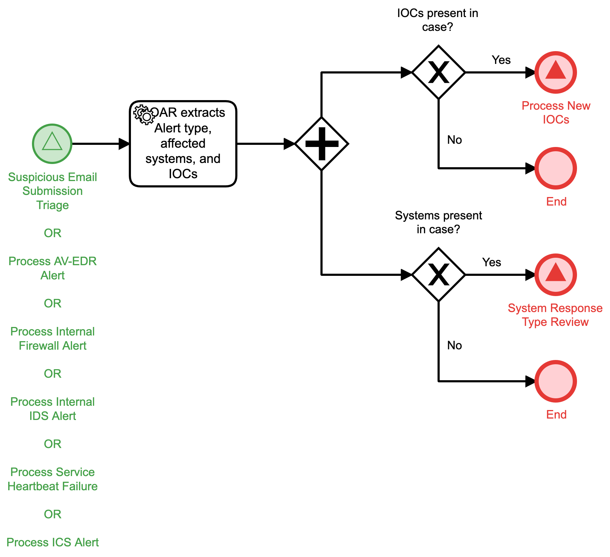

# Identify Systems and IOCs Detail

## Description
This workflow's purpose is to process a variety of internal alerts and identify 
appropriate follow-on actions.

- For Indicators of Compromise (IOC) identified from the alert, the "Process New IOCs" 
(Detect) workflow is called.
- For any affected systems identified from the alert, the "System Response Type Review"
(Detect) workflow is called.

This workflow may be called from a variety of other workflows including:
- "Suspicious Email Submission Triage" (Detect)
- "Process AV-EDR Alert" (Detect)
- "Process Internal Firewall Alert" (Detect)
- "Process Internal IDS Alert" (Detect)
- "Process Service Heartbeat Failure" (Detect)
- "Process ICS Alert" (Detect)

## Workflow 

