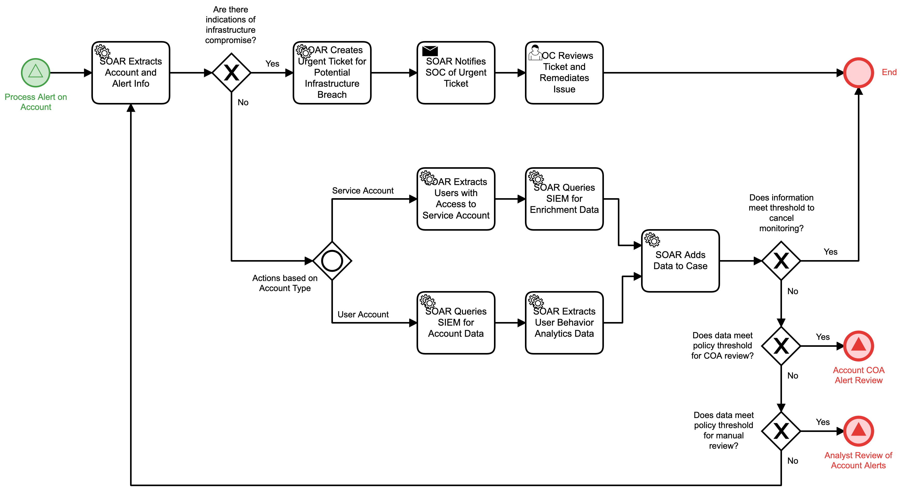

# Monitor Account Detail

## Description
This workflow will extract information on a user or service account for monitoring if
criteria are met from an alert on an account. 

- In the event that it appears to be an infrastructure breach, an urgent ticket is sent
to the SOC and the automation terminates
- If criteria are met to cancel monitoring, the workflow terminates
- If criteria are met for action to be taken, the "Account COA Alert Review" (Respond)
workflow is triggered.
- If criteria are met for a manual review, the "Analyst Review of Account Alerts" 
(Respond) workflow is triggered.

This workflow is called by the "Process Alert on Account" (Detect) workflow.

## Workflow 

