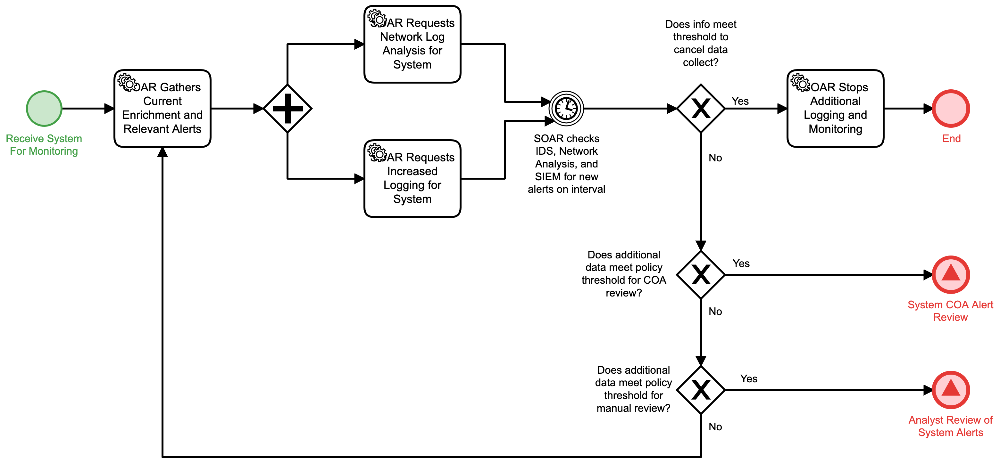

# Monitor Internal System Detail

## Description
This workflow collects additional data on potentially affected systems in response to an
internal alert. It utilizes a fixed interval to collect data and review for follow on 
action:
- If the criteria are met to stop monitoring, the workflow is terminated.
- If criteria are met to take action, the "System COA Alert Review" (Respond) workflow 
is triggered.
- If criteria are met for a human review, the "Analyst Review of System Alerts" (Detect)
workflow is triggered.

This workflow is called by the "System Response Type Review" (Detect) workflow.

## Workflow 

