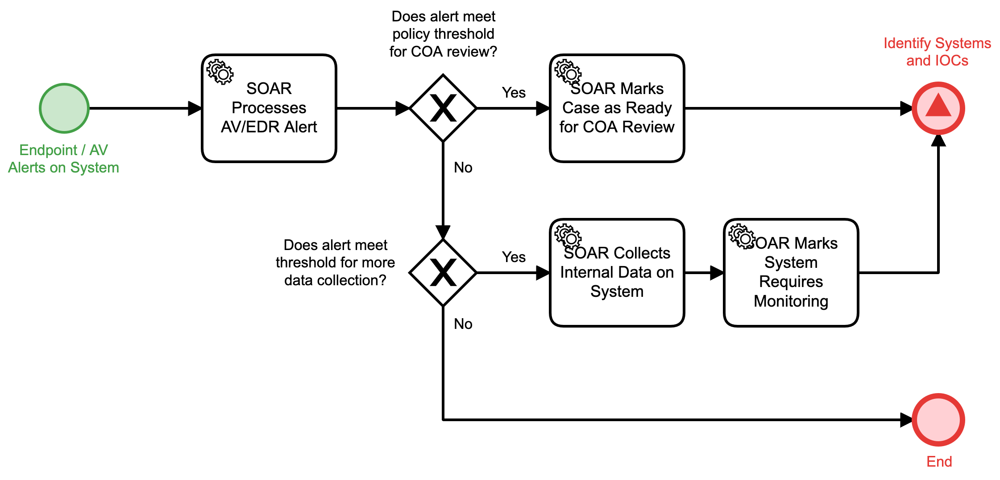

# Process AV-EDR Alert Detail

## Description
This workflow is triggered by a new alert present from Antivirus or Endpoint Detection and
Response (EDR) infrastructure.

- If criteria are met for taking action or for collecting more data, the "Identify Systems
and IOCs" (Detect) workflow is triggered.
- In all other cases, the workflow will terminate.

## Workflow 

