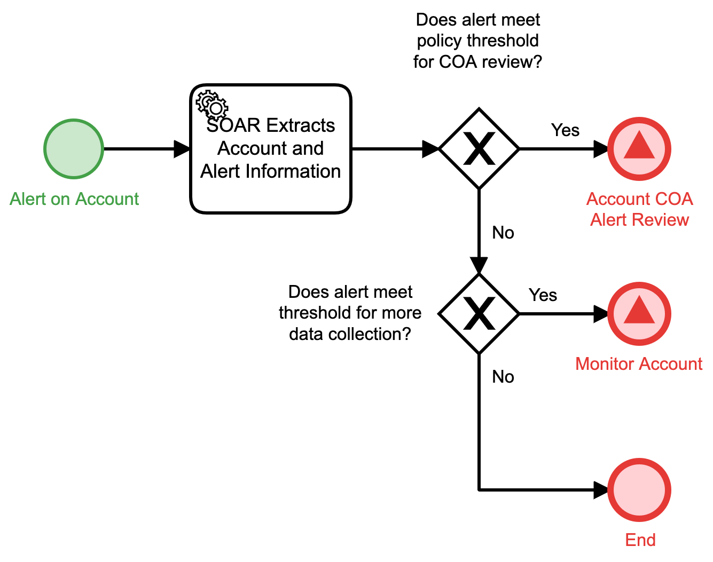

# Process Alert on Account Detail

## Description
This workflow is designed to start when a new alert is present that involves an internal
account. It is envisioned that this would be a triggering alert from a SIEM, but it could
be customized for other environments.

- If the alert meets criteria for taking action, the "Account COA Alert Review" (Respond) 
workflow is triggered.
- If the alert meets criteria for more data collection, the "Monitor Account" (Detect) 
workflow is triggered.
- In all other cases, the workflow will terminate

## Workflow 

