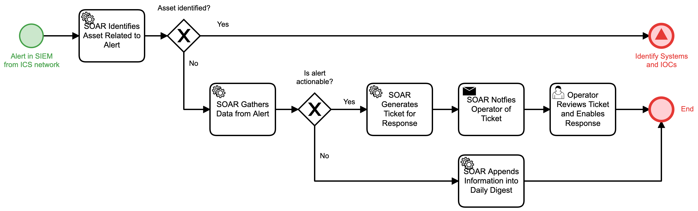

# Process ICS alert Detail

## Description
This workflow is triggered by a new alert present in the SIEM that originates from an 
Industrial Control System network.

- If the affected ICS asset can be identified, the "Identify Systems and IOCs" (Detect)
workflow is triggered.
- If the asset cannot be identified but the alert is actionable, an operator is notified 
to respond to the issue
- In all other cases, the information is appended to a digest and the workflow terminates.

## Workflow 

