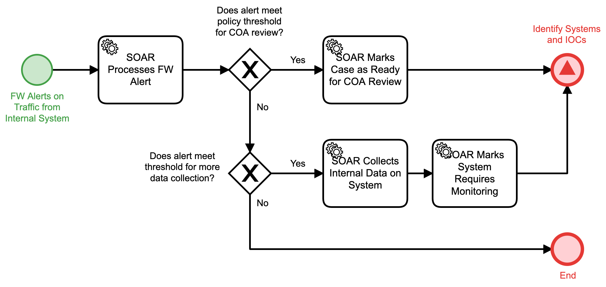

# Process Internal FW Alert Detail

## Description
This workflow is triggered by a new alert present from the firewall that involves 
an internal system on the network.

- If criteria are met for taking action or for collecting more data, the "Identify Systems
and IOCs" (Detect) workflow is triggered.
- In all other cases, the workflow will terminate.
## Workflow 

