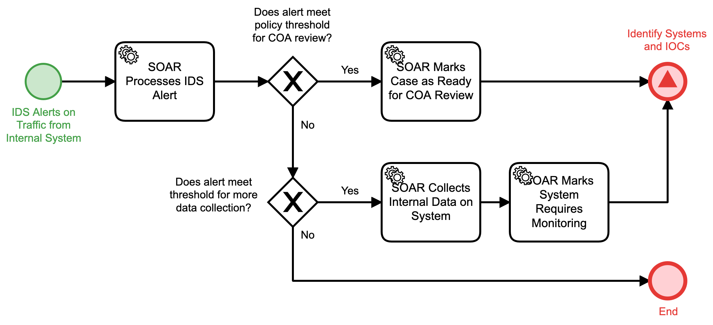

# Process Internal IDS Alert Detail

## Description
This workflow is triggered by a new alert present from the Intrusion Detection System 
(IDS) that involves traffic to or from an internal system.

- If criteria are met for taking action or for collecting more data, the "Identify Systems
and IOCs" (Detect) workflow is triggered.
- In all other cases, the workflow will terminate.

## Workflow 

