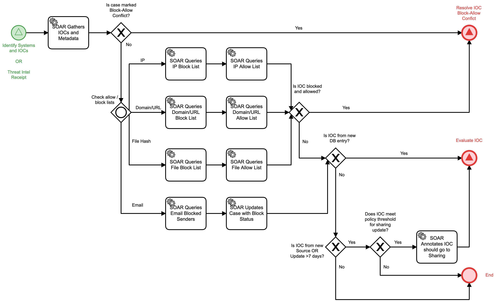

# Process New IOCs Detail

## Description
This workflow begins the process of determining the appropriate action for a received 
Indicator of Compromise (IOC). The workflow will check relevant block and allow lists to
determine if the IOC is on either of those lists.

- For IOCs that have been found on both a block and allow list, the "Resolve IOC Block - 
Allow Conflict" (Recover) workflow is triggered.
- For IOCs that are new, from a new source, updated after a 7 day period, and/or meet the 
criteria for sharing IOCs, the "Evaluate IOC" (Detect) workflow is triggered
- For all other cases, the workflow will terminate.

This workflow can be called from the following workflows:
- "Identify Systems and IOCs" (Detect)
- "Threat Intel Receipt" (Identify)

## Workflow 

