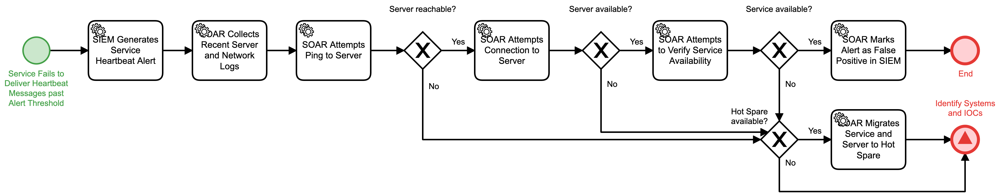

# Process Service Heartbeat Failure Detail

## Description
This workflow is triggered when a service fails to deliver the required heartbeat messages
within an approved threshold.  The workflow will collect all available information on 
both the service and the hosting server.

- If the heartbeat failure is determined to be a false positive, the workflow will 
terminate.
- Otherwise, the workflow will attempt to migrate to a hot spare if available and the 
"Identify Systems and IOCs" (Detect) workflow will be triggered.

## Workflow 

