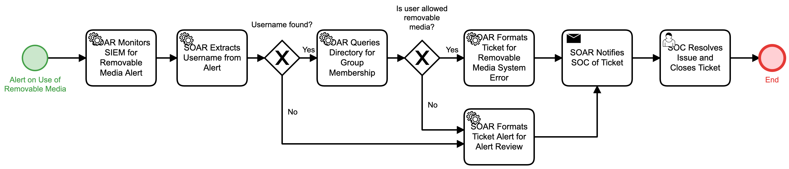

# Removable Media Alert Detail

## Description
This workflow is triggered by an alert on the use of removable media. The workflow will
collect information on the user that attempted the use of removable media and collect 
relevant information.
- If the user was allowed removable media use, a ticket is created to resolve the error
causing the alert.
- If the user is not allowed removable media use, a ticket is created so that the SOC
may resolve the issue with the user.

## Workflow 

