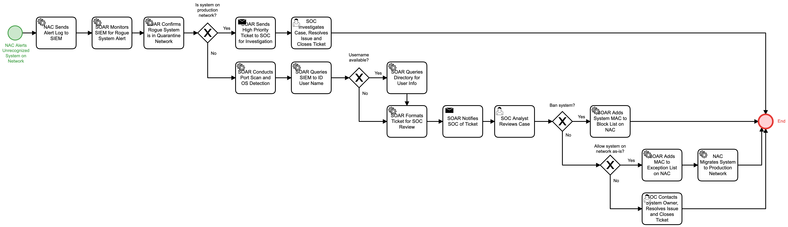

# Rogue System Detected Detail

## Description
This workflow handles alerts when an unrecognized system attempts to connect to the 
network.

- In the event that the unrecognized system is successfully connected to the production
network, the SOC is notified for immediate response.
- In other cases, the workflow will attempt to identify which approved users, if any,
are attempting to connect the system and the SOC will be notified via a ticket that has
been enriched with as much information that can be captured about the unauthorized 
system.  The decision on whether to allow or ban the system is left to the SOC.

## Workflow 

