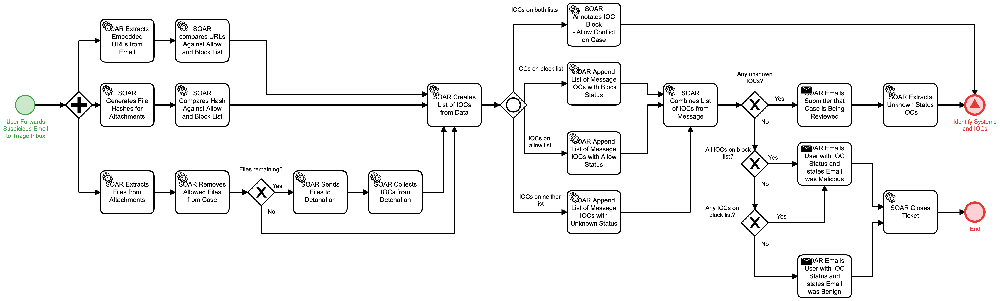

# Suspicious Email Submission Triage Detail

## Description
This workflow is initiated when a user forwards a suspicious email to the SOC phishing
triage inbox.  The workflow will extract all potential IOCs from the email, compare those
IOCs against known allow and block lists, and collect reputation information on the IOCs.

- For any IOCs on both allow and block lists, that status will be annotated to the case
and the "Identify Systems and IOC" (Detect) workflow will be triggered.
- Any IOCs with unknown status will cause the "Identify Systems and IOCs" (Detect) 
workflow to be triggered as well.
- For known malicious IOCs, the user will receive an email notifying them that the mail
was in fact malicious and the workflow will terminate.
- If all IOCs are known good, the user will be notified that the message was not 
malicious and the workflow will terminate.

## Workflow 

