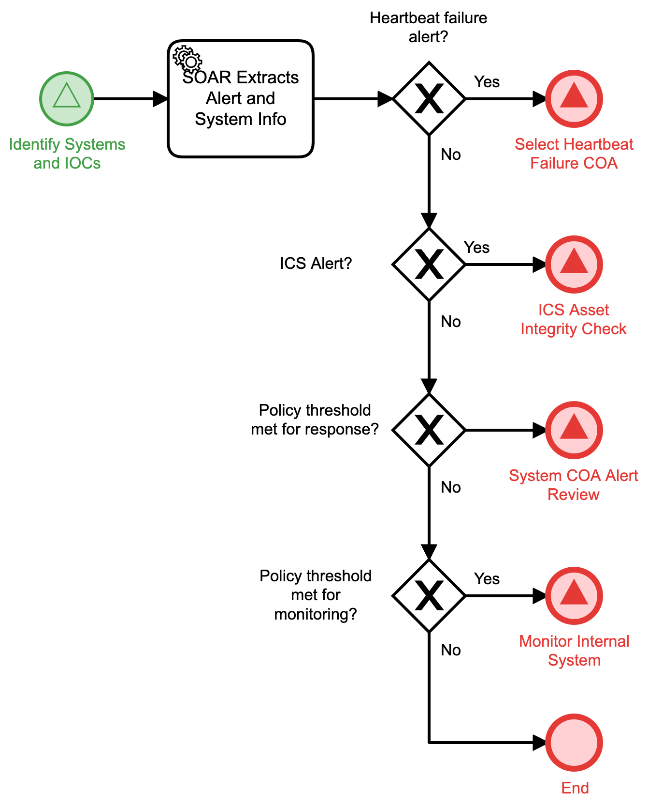

# System Response Type Review Detail

## Description
This workflow will forward cases based on alerts to the appropriate subsequent workflows.

- For cases based on heartbeat failure alerts, the "Select Heartbeat Failure COA" 
(Respond) workflow is triggered.
- For cases based on ICS alerts, the "ICS Asset Integrity Check" (Detect) 
workflow is triggered.
- For cases that meet policy thresholds for automated response, the "System COA Alert
Review" (Respond) workflow is triggered.
- For cases that meet policy thresholds for monitoring, the "Monitor Internal System"
workflow (Detect) is triggered.
- For all other cases, the workflow terminates.

This workflow is called from the "Identify Systems and IOCs" (Detect) workflow.

## Workflow 

