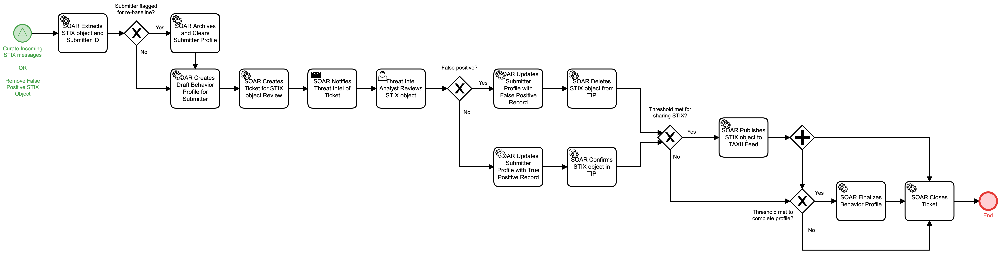

# Create Submitter Behavior Profile Detail

## Description
This workflow creates profiles for threat intelligence submitters so an organization may
apply policy on submitted IOCs, TTPs, or other artifacts (such as IDS rules) based on that
organization's opinion of the submitter's quality. 

- If a submitter's activity has met the threshold for creating a new profile, the original
profile is archived and the profile is re-initialized.
- For intelligence submissions that are deemed false positives, the submitter's reputation
is updated and the relevant STIX files are deleted from the Threat Intelligence Platform 
(TIP)
- For intelligence submissions that are valid, the submitter profile is updated and the
STIX is confirmed in the TIP
- If enough data has been collected to complete the profile, the automation will flag the 
profile as complete and will stop processing for that submitter unless it is flagged for
re-baseline in the future

This workflow can be called from the following workflows:

- "Curate Incoming STIX messages" (Identify)
- "Remove False Positive STIX Object" (Identify)

## Workflow 

