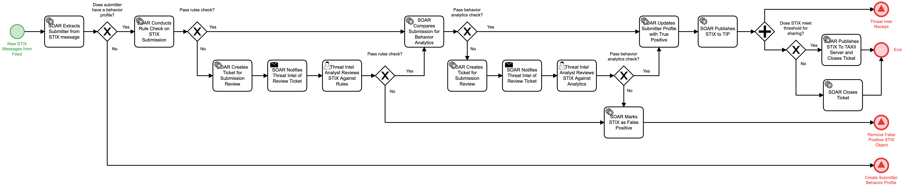

# Curate Incoming STIX messages Detail

## Description
This workflow reviews submitted STIX messages to determine their validity and whether 
modifications are needed for the submitters profile. 

The data in the STIX object first is
reviewed by a set of rules determined by the SOC. In the event that the STIX object fails
a rule check, a ticket is generated for the Threat Intelligence analyst to determine if it
truly fails the rule check.

If the object passes a rule check, it is then reviewed against behavior analytics based on 
the submitter's profile. Failure of the behavior results in a ticket for the Threat 
Intelligence Analyst to determine if it truly fails the behavior check.

- For submitters that do not have a behavior profile, the "Create Submitter Behavior
Profile" (Identify) workflow is triggered.
- For STIX objects that pass both checks, the "Threat Intel Receipt" (Identify) workflow is 
triggered.
- For STIX objects that also meet the threshold for sharing, the object is published to a
TAXII server for sharing
- For STIX objects that fail either check, the STIX is marked as a false positive and the 
"Remove False Positive STIX Object" (Identify) workflow is triggered.

## Workflow 

