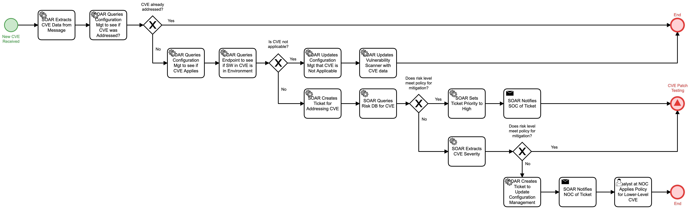

# Process Incoming CVE Detail

## Description
This workflow is triggered when a new Common Vulnerability Enumeration (CVE) message is
received.  

- For CVEs that have already been addressed, the workflow terminates
- For CVEs that have no presence in the network, vulnerability scanners are updated and 
the CVE is marked as Not Applicable, resulting in the workflow terminating.
- For CVEs whose risk or severity meet the threshold for response, the "CVE Patch Testing"
(Protect) workflow is triggered.
- For all other CVEs, a ticket is generated for the Network Operations Center (NOC) to 
address the CVE within approved policy.

## Workflow 

