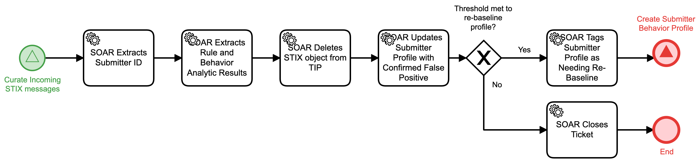

# Remove False Positive STIX Object Detail

## Description
This workflows process STIX objects that have been marked as a false positive. It will
delete the STIX object from the Threat Intelligence Platform (TIP) and update the 
submitter's behavior profile.

- If policy thresholds have been met to justify re-baseline of the submitter profile, the
"Create Submitter Behavior Profile" (Identify) workflow is triggered.
- In all other cases, the workflow terminates

This workflow is called from the "Curate Incoming STIX messages" (Identify) workflow.

## Workflow 

