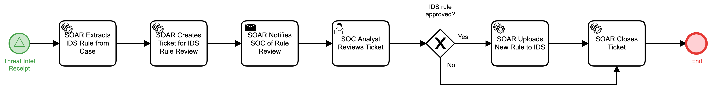

# Review Submitted IDS Rules Detail

## Description
This workflow processes Intrusion Detection System (IDS) rules that have been submitted
by outside organizations. It creates a ticket for SOC analyst review.

- If the SOC approves the rule, the workflow will add the rule to the IDS and then
terminate.
- If the SOC rejects the rule, the workflow will terminate.

This workflow is called by the "Threat Intel Receipt" (Identify) workflow.

## Workflow 

