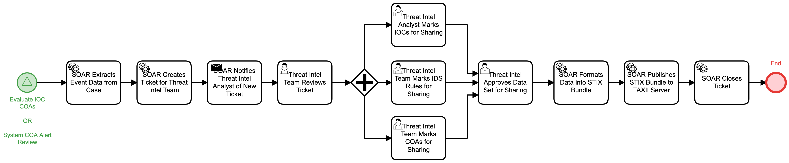

# Share Event Information Detail

## Description
This workflow formats information from a security case that have been marked for sharing.
It creates a ticket for the Threat Intelligence team to review the shared data and mark
appropriate IOCs, IDS rules, and COAs that should be shared with an organization's 
community. The approved data is then formatted into STIX by the automation and shared via
a TAXII server upload.

This workflow may be called by the following workflows:
- "Evaluate IOC COAs" (Respond)
- "System COA Alert Review" (Respond)

## Workflow 

