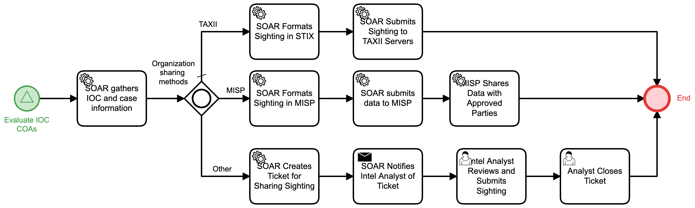

# Submit IOC Sighting Detail

## Description
This workflow gathers and submits sighting data for an IOC when it has met an 
organization's policy for sighting submission. It formats and submits based on the 
organization's preferred method for sharing.

This workflow is called by the "Evaluate IOC COAs" (Respond) workflow.

## Workflow 

