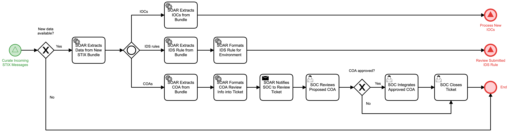

# Threat Intel Receipt Detail

## Description
This workflow process new information found in a received STIX object.

- If no new data is found in the STIX object, the workflow terminates
- IOCs found in the STIX object are extracted and the "Process New IOCs" (Detect) workflow is 
triggered.
- IDS rules found in the STIX object are extracted and the "Review Submitted IDS Rule" 
(Identify) workflow is triggered.
- COAs received in the STIX object are formatted into a ticket for the SOC to review and
determine whether and how to employ the COA.

This workflow is called by the "Curate Incoming STIX Messages" (Identify) workflow.

## Workflow 

