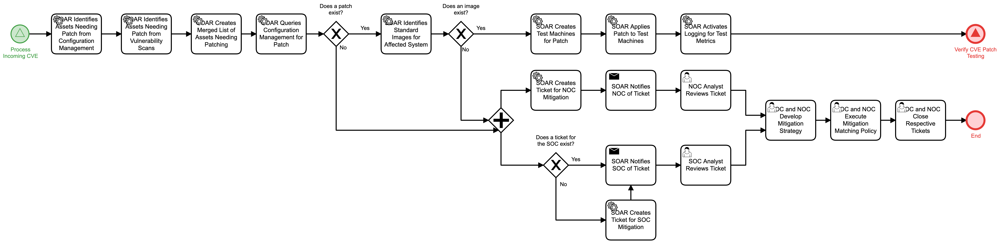

# CVE Patch Testing Detail

## Description
This workflow receives a CVE that requires patching and/or mitigation within an 
organization's network.  The workflow will identify necessary systems and available
patches.

- When a patch exists and a test image for affected assets can be found, the workflow 
will create test machines for the patch, deploy the patch, and begin logging for test
metrics. This will call the "Verify CVE Patch Testing" (Protect) workflow.
- In all other cases, the workflow will combine all relevant data and initiate 
collaboration between the Security and Network Operations Centers so that the CVE can be
addressed.

This workflow is called by the "Process Incoming CVE" (Identify) workflow.

## Workflow 

