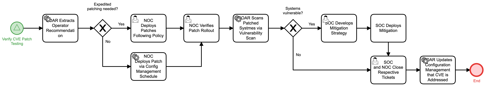

# Patch Systems for CVE Detail

## Description
This workflow assists the patching of systems affected by a CVE after the CVE patch 
testing has been verified.

For CVEs requiring expedited patching, the Network Operations Center is notified so that
the patch may be deployed rapidly.

For other patches, they are deployed via configuration management in accordance with 
policy.

After patch rollout is verified, the automation conducts vulnerability scans. If systems
are still vulnerable, the Security Operations Center is notified to develop a mitigation
strategy and deploy the strategy.

This workflow is called by the "Verify CVE Patch Testing" (Protect) workflow.

## Workflow 

