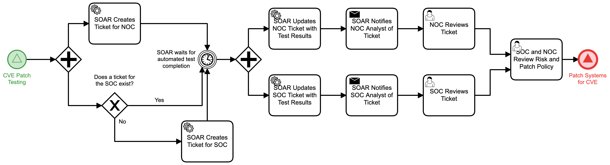

# Verify CVE Patch Testing Detail

## Description
This workflow collects testing data from automated patch testing, notifies both the 
Network and Security Operations Centers of the results via tickets, and facilitates the
SOC and NOC review so that both policy and risk can be mitigated.

Once agreement is reached on the patch effectiveness, the "Patch Systems for CVE" (Protect) 
workflow is triggered.

This workflow is called by the "CVE Patch Testing" (Protect) workflow.

## Workflow 

