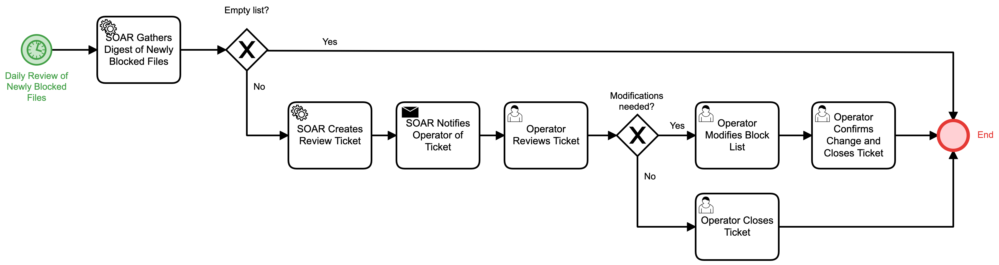

# Blocked File Digest Review Detail

## Description
This workflow is designed to run daily in order to review files that have been added to
an organization's block list.

- If the list is empty for that day, the workflow terminates.
- For all other cases, a review ticket is generated for the SOC to facilitate any 
modifications to the block list if they are needed (e.g. if a blocked file was determined
to be a false positive)

## Workflow 

