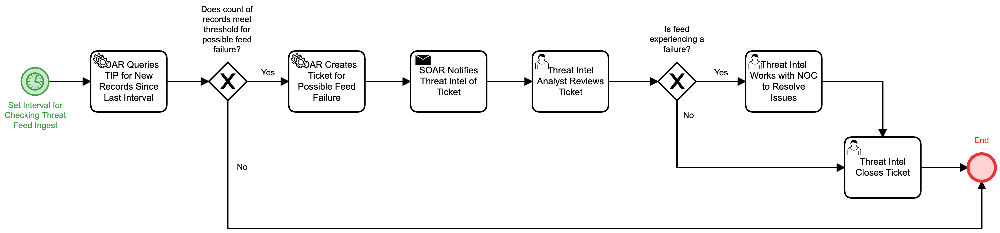

# Monitor Threat Feed Ingest Detail

## Description
This workflow monitors incoming threat intelligence feeds on a regular interval and 
notifies the Threat Inteligence team if a potential failure in the feed connectivity is
observed. 

## Workflow 

