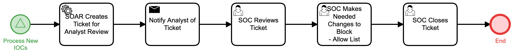

# Resolve IOC Block-Allow Confilict Detail

## Description
This workflow notifies the SOC if an IOC appears on both a block and an allow list so that
the SOC can determine and deploy a mitigation to that status.

The workflow is called by the "Process New IOCs" (Detect) workflow.

## Workflow 

