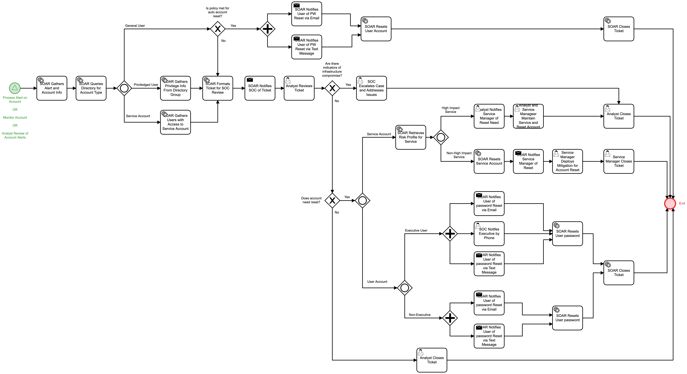

# Account COA Alert Review Detail

## Description
This workflow manages tasks related to responding to alerts regarding network accounts.
There are multiple steps to enforce policy for general users, privileged users, and 
service accounts. 

When in accordance with policy, automatic password resets are sent.

In cases that require more review, the appropriate analysts, users, and service owners are
notified so that efficient collaboration and resolution can take place.

This workflow is called from the following workflows:
- "Process Alert on Account" (Detect)
- "Monitor Account" (Detect)

## Workflow 

