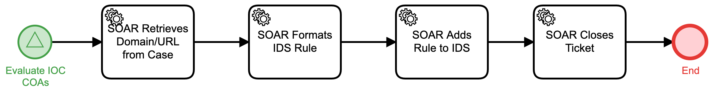

# Add Domain-URL to IDS Detail

## Description
This workflow retrieves a Domain-URL IOC, formats it for submission to an Intrusion
Detection System, and adds the rule to the IDS.

The workflow is called from the "Evaluate IOC COAs" (Respond) workflow.

## Workflow 

