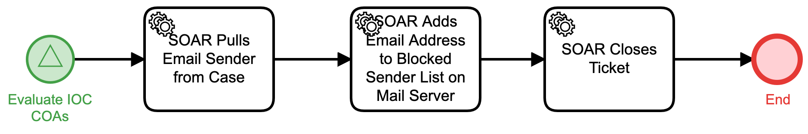

# Add Email to Blocked Senders List Detail

## Description
This workflow extracts an email sender address from an IOC and adds that address to the 
blocked sender's list on the mail server.

The workflow is called from the "Evaluate IOC COAs" (Respond) workflow.

## Workflow 

