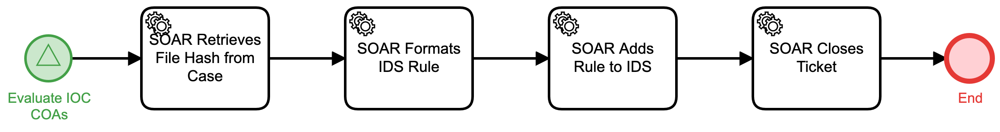

# Add File Hash to IDS Detail

## Description
This workflow extracts a file hash from an IOC, formats an Intrusion Detection Rule to
search for that hash, and uploads the rule to the IDS.

The workflow is called from the "Evaluate IOC COAs" (Respond) workflow.

## Workflow 

