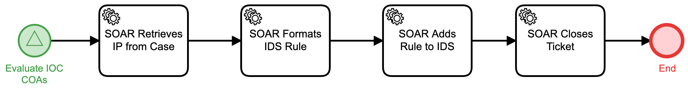

# Add IP to IDS Detail

## Description
This workflow extracts an IP address from an IOC, formats an Intrusion Detection System
rule to monitor for traffic to/from that address, and loads the rule onto the IDS.

This workflow is called from the "Evaluate IOC COAs" (Respond) workflow.

## Workflow 

