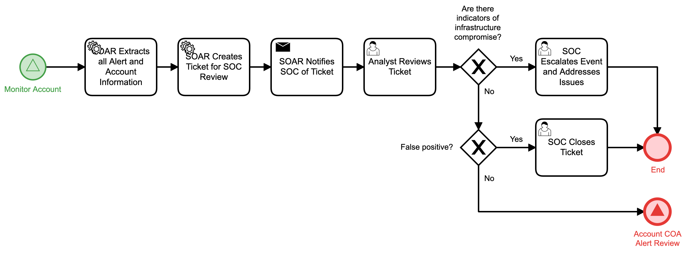

# Analyst review of Account Alert Detail

## Description
This workflow assists the SOC analyst in reviewing alerts and monitoring with respect to
a case involving a flagged account.

- If the case data indicates an infrastructure breach, the event is escalated for manual
response and the automation workflow terminates.
- If the analyst determines the case to be a false positive, the workflow terminates.
- In all other cases, the "Account COA Alert Review" (Respond) workflow is triggered.

This workflow is called from the "Monitor Account" (Detect) workflow.

## Workflow 

