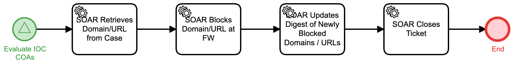

# Block Domain-URL at Firewall Detail

## Description
This workflow extracts a Domain-URL from the case, enables a block of the Domain-URL at 
the firewall, and updates a digest of newly blocked Domains-URLs.

The workflow is called from the "Evaluate IOC COAs" (Respond) workflow.

## Workflow 

