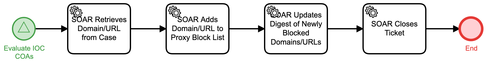

# Block Domain-URL at Proxy Detail

## Description
This workflow extracts a Domain-URL from an IOC, formats it to submit towards an 
internet proxy / DNS sinkhole, and uploads the Domain-URL to the proxy.

The workflow is called from the "Evaluate IOC COAs" (Respond) workflow.

## Workflow 

