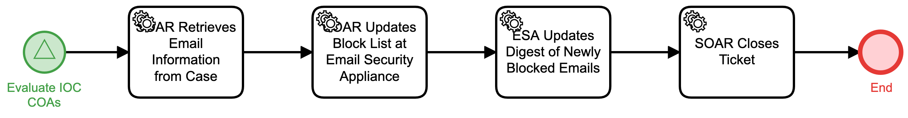

# Block Email to Email Security Appliance Detail

## Description
This workflow extracts an email sender address from an IOC, uploads that address to an
Email Security Appliance, and updates a digest of newly blocked email.

The workflow is called from the "Evaluate IOC COAs" (Respond) workflow.

## Workflow 

