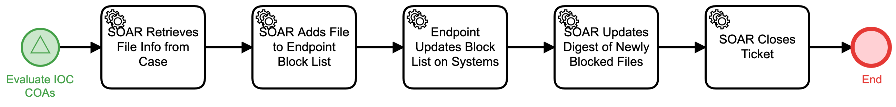

# Block File at Endpoint Detail

## Description
This workflow extracts file information from an IOC, adds it to an Endpoint Detection and
Response (EDR) server for blocking, has EDR push that policy down to protected systems,
and updates a digest of newly blocked files.

The workflow is called by the "Evaluate IOC COAs" (Respond) workflow.

## Workflow 

