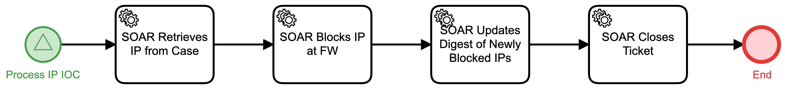

# Block IP at Firewall Detail

## Description
This workflow extracts an IP address from an IOC, blocks that IP at the firewall, and 
updates a daily digest of newly blocked IPs.

The workflow is called from the "Evaluate IOC COAs" (Respond) workflow.

## Workflow 

