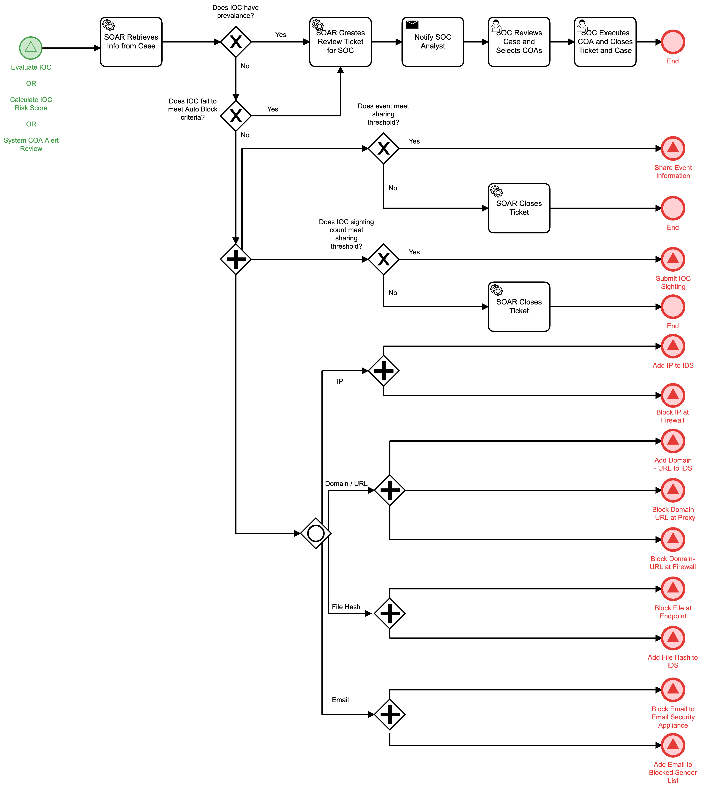

# Evaluate IOC COAs Detail

## Description
This workflow aids in the response to malicious IOCs.

If the IOC has prevalence / history on the network or if it fails to meet criteria for 
automatic blocking, a SOC analyst is notified so that the proper COA can be employed to
respond to the threat.

If the IOC meets the criteria for sharing information, the "Share Event Information" 
(Identify) workflow is triggered.

If the IOC results in a sighting and that sighting meets the sharing threshold, the
"Submit IOC Sighting" (Identify) workflow is triggered.

If automated block criteria are met, the following workflows are triggered based by IOC
type:
- "Add IP to IDS" (Respond)
- "Block IP at Firewall" (Respond)
- "Add Domain-URL to IDS" (Respond)
- "Block Domain-URL at Proxy" (Respond)
- "Block Domain-URL at Firewall" (Respond)
- "Block File at Endpoint" (Respond)
- "Add File Hash to IDS" (Respond)
- "Block Email to Email Security Appliance" (Respond)
- "Add Email to Blocked Sender List" (Respond)

The workflow may be called by the following workflows:
- "Evaluate IOC" (Detect)
- "Calculate IOC Risk Score" (Detect)
- "System COA Alert Review" (Respond)

## Workflow 

