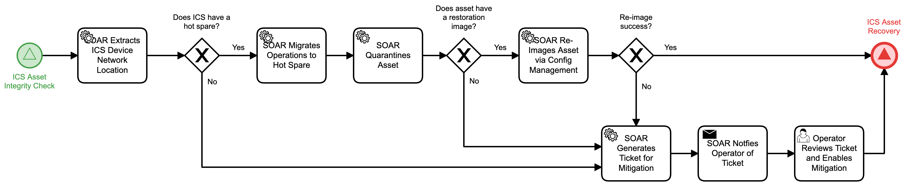

# ICS Asset Mitigation Detail

## Description
This workflow identifies an ICS asset that requires mitigation and quarantines the 
affected asset, migrates to a hot spare,  and restores the asset via configuration 
management if a restoration image is present.

If there is no spare or no restoration image, the workflow notifies the ICS operator to
develop mitigation.

Once complete, this workflow triggers the "ICS Asset Recovery" (Respond) workflow.

This workflow is called from the "ICS Asset Integrity Check" (Detect) workflow.

## Workflow 

