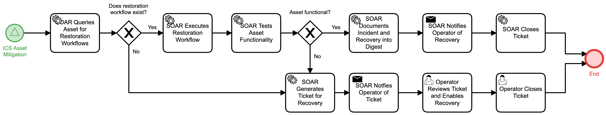

# ICS Asset Recovery Detail

## Description
Once mitigated, this workflow restores an ICS asset and tests asset functionality before
confirming the incident involving the ICS asset has been resolved.

In the event that restoration workflows do not exist or an asset fails final 
functionality test, the workflow notifies the ICS operator to manually restore
functionality of the asset.

This workflow is called from the "ICS Asset Mitigation" (Respond) workflow.

## Workflow 

