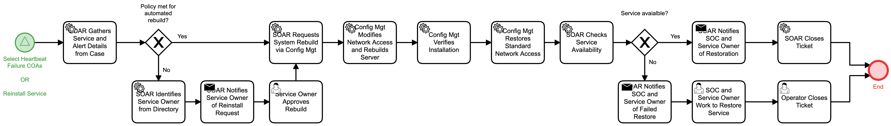

# Rebuild Server Detail

## Description
This workflow restores a server from a restoration image and confirms service 
availability.

If policy is not met for an automated rebuild, the workflow notifies the service owner
to approve the rebuild.

If the service is not available after rebuild, the SOC and service owner are notified to 
collaborate on restoration of services.

This workflow can be called by the following workflows:

- "Select Heartbeat Failure COAs" (Respond)
- "Reinstall Service" (Respond)

## Workflow 

