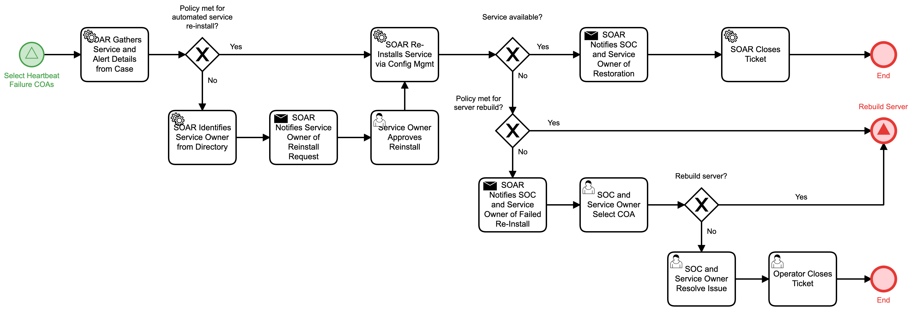

# Reinstall Service Detail

## Description
This workflow collects information from a service that generated a heartbeat failure
alert and attempts to reinstall the service from configuration management if policy is 
met for automated reinstall.

If policy does not allow for automated reinstall, the service owner is notified to 
approve the reinstall.

- If the service is confirmed available, the workflow terminates.
- If the service is not available and policy is met for rebuild, the "Rebuild Server" 
(Respond) workflow is triggered.
- If the service is not available and policy is not met for rebuild, an the SOC and 
service owner are notified to either send the asset to the "Rebuild Server" (Respond)
workflow or manually resolve the issue.

This workflow is called by the "Select Heartbeat Failure COAs" (Respond) workflow.

## Workflow 

