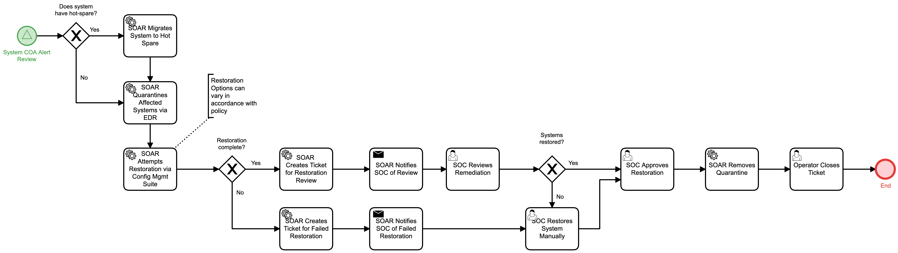

# Remediate Systems Detail

## Description
This workflow receives a system that requires remediation, attempts to migrate to a hot
spare if possible, quarantines the system, and then attempts to restore via configuration
management in accordance to policy.  

If the restoration does not complete automatically, the SOC is notified to restore the 
system manually.

Once restored, the system is brought out of quarantine and the automation terminates.

This workflow is called by the "System COA Alert Review" (Respond) workflow.

## Workflow 

