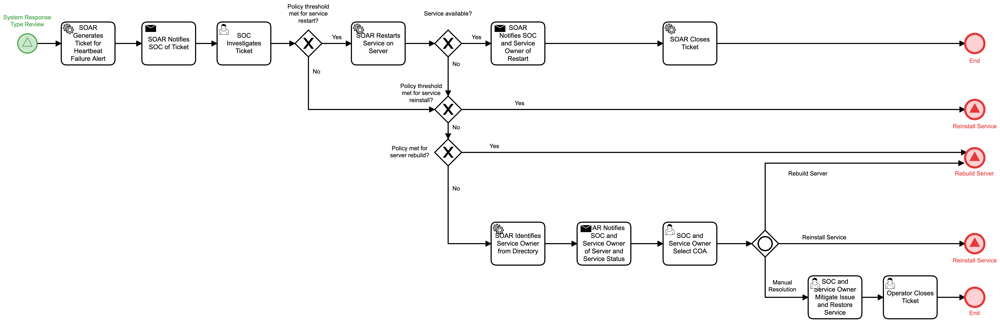

# Select Heartbeat Failure COAs Detail

## Description
This workflow assists in the process of restoring systems and services when a heartbeat
failure alert has been associated with a service. The workflow will notify the SOC who may 
approve service restart.

- If restart restores the service, the owner is notified of restart and the workflow
terminates
- If restart fails to restore, and policy is met for service reinstall, the "Reinstall 
Service" (Respond) workflow is triggered.
- If restart fails to restore, and policy is not met for service reinstall, the workflow
will check to see if policy is met for server rebuild and trigger the "Rebuild Server"
(respond) workflow if conditions are met.
- In all other cases, the workflow notifies the service owner and SOC to select an 
appropriate action:
    - Trigger the "Reinstall Service" (Respond) workflow
    - Trigger the "Rebuild Server" (Respond) workflow
    - Resolve the issue manually
    
This workflow is called from the "System Response Type Review" (Detect) workflow.  

## Workflow 

